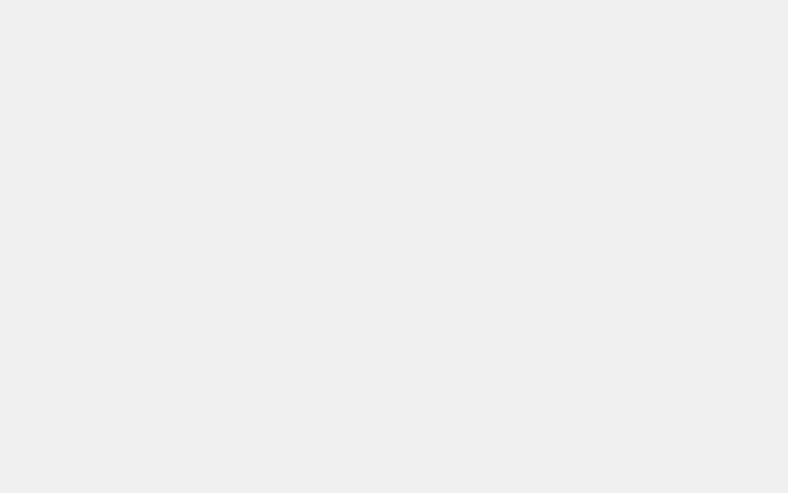

Milano ships with several pre-built demos. Each one is a complete site you can import in one click. Choose the demo closest to your industry and customize it from there.

:::note
New demos are added with theme updates. Check back after each update for fresh options.
:::

<!-- TODO(user): Replace the placeholder demos below with the actual Milano demos. For each demo, add a heading, one-line description, and a screenshot. -->

## Demo 1

<!-- TODO(screenshot): Capture the Demo 1 homepage at 1440×900, no browser frame. -->

A modern storefront with a large hero section, featured products, and a clean footer. Good for fashion and lifestyle stores.

[Import this demo](../import-a-demo/)

## Demo 2

<!-- TODO(screenshot): Capture the Demo 2 homepage at 1440×900, no browser frame. -->

A grid-based layout with category tiles and a minimal header. Works well for electronics and multi-category stores.

[Import this demo](../import-a-demo/)

## Demo 3

<!-- TODO(screenshot): Capture the Demo 3 homepage at 1440×900, no browser frame. -->

A single-product focused layout with a full-screen hero and detailed product showcase. Ideal for stores with one hero product.

[Import this demo](../import-a-demo/)
