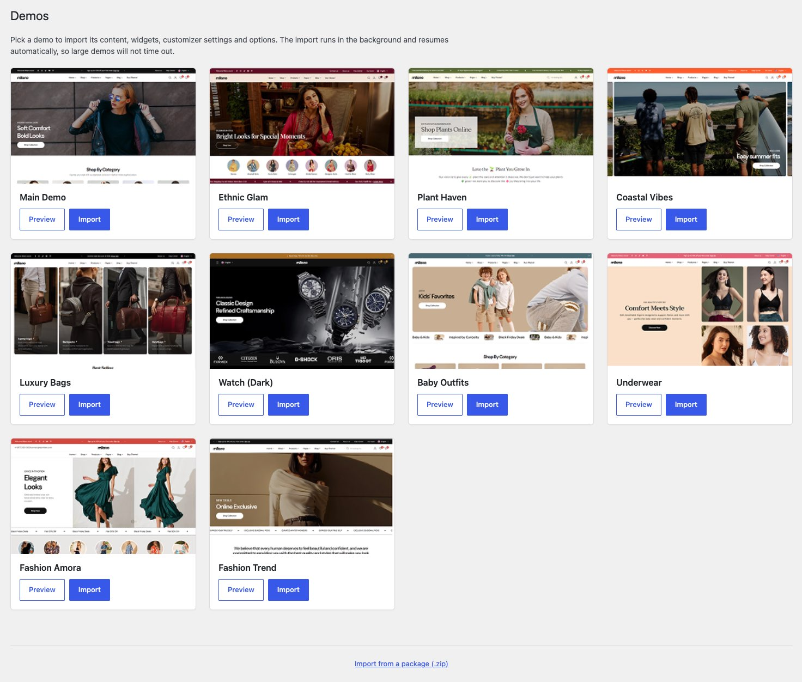

Milano ships with a set of pre-built demos — full storefronts with pages, products, menus, and Customizer settings already configured. Importing a demo is the fastest way to a working site. You can then replace the content, products, and images with your own.

The [setup wizard](./use-the-setup-wizard/) offers the demo import as its last step, right after registering your purchase code and installing the required plugins. You can also import a demo at any time from the WP admin.

## Before you import

You need three things in place first:

1. **Milano is installed and activated** — see [Install Milano](./install-milano/).
2. **WooCommerce and Elementor are installed and active** — see [Install required plugins](./install-required-plugins/).
3. **A clean site is recommended** — demos work best on a fresh WordPress install. If you have existing content, back it up first.

## What a demo import does

A full import adds a complete storefront to your site:

- **Pages** — home, shop, product, cart, checkout, blog, contact, and any demo-specific pages.
- **Products** — sample products with placeholder images, descriptions, and prices.
- **Menus** — pre-built navigation matching the demo.
- **Customizer settings** — colors, typography, and layout options matching the demo.
- **Widgets** — sidebar and footer widgets matching the demo.
- **Media** — demo images, icons, and the site logo.

You can also run a **custom import** to bring across only specific parts — for example, only the Customizer settings without overwriting your existing content.

## When to skip the demo

A demo import is the fastest way to a working site, but it is not always the right choice:

- **You have an existing site with content** — importing over your content will overwrite it. Back up first, or use a **custom import** with only Customizer settings selected.
- **You want a fully custom design** — starting from scratch in Elementor and the Customizer gives you a clean canvas.
- **You are on shared hosting with tight resource limits** — a full import can take several minutes and may hit PHP limits. Increase `max_execution_time` and `memory_limit` before importing, or import parts separately.

## Import a full demo

1. Go to **Milano → Demos** in your WordPress admin.

   

2. Browse the demos and click **Import** on the one you want.

3. A confirmation dialog appears. Click **Import** to start.

4. Wait for the import to finish. You will see a progress bar for each step: installing plugins, importing content, Customizer settings, and widgets.

5. When the import is complete, click **View your site** to see the result.

:::tip
Keep the demo importer tab open until the import finishes. Closing the tab mid-import may leave your site in a partial state.
:::

## Import specific parts

If you only want certain parts of a demo, click **Custom Import** on the demo card instead of **Import**. You can then choose which items to import:

- **Content** — pages, posts, products, and media.
- **Customizer settings** — colors, typography, layout options.
- **Widgets** — sidebar and footer widget areas.

Select the items you want and click **Import Selected**.

## Troubleshooting

**Problem:** The import stops at a certain percentage and does not continue.
**Fix:** This is usually a server timeout. Increase your PHP `max_execution_time` to at least 300 seconds and `memory_limit` to 256 MB or higher. Then retry the import.

**Problem:** "Failed to import content" error.
**Fix:** Check that WooCommerce and Elementor are installed and activated. The demo content depends on these plugins.

**Problem:** The imported demo looks different from the preview.
**Fix:** Make sure the Customizer settings were imported. Go to **Milano → Demos** and run a Custom Import with only "Customizer settings" selected.
