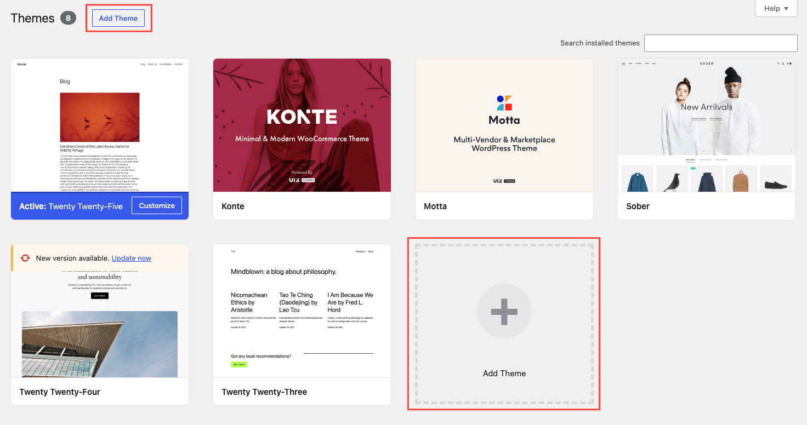
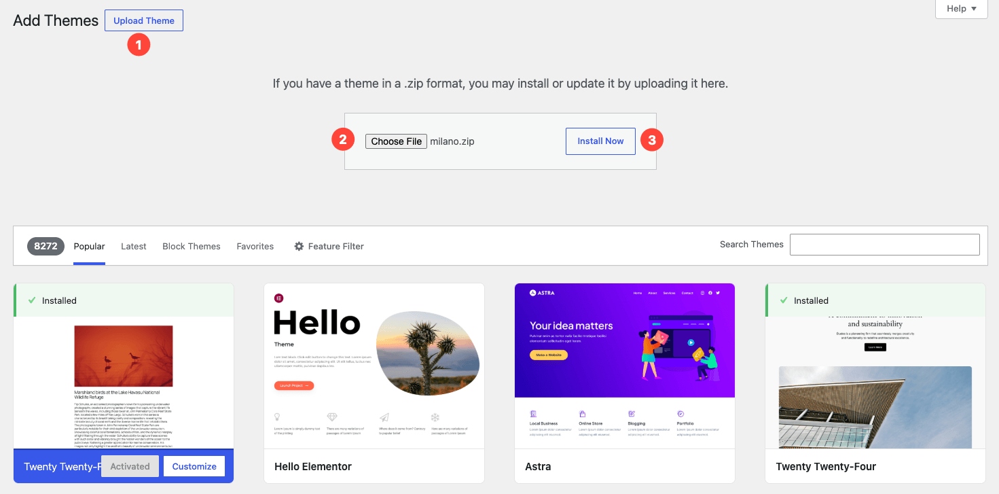

This page walks you through installing the Milano theme on your WordPress site. You can upload it through the WordPress admin (recommended) or via FTP if your host has a small upload limit.

:::tip
Looking for the fast path? After activation, Milano opens the [setup wizard](../use-the-setup-wizard/) and handles purchase code, child theme, plugins, and demo import for you. This page is the manual fallback.
:::

## Before you begin

- A working WordPress site (WordPress 5.9 or higher, PHP 7.4 or higher).
- The Milano theme zip file from your ThemeForest download. **Do not extract it** — you will upload the zip as-is.
- Admin access to your WordPress dashboard.

If you haven't downloaded Milano yet, go to your ThemeForest **Downloads** page and click **Download** next to Milano. Choose the "Installable WordPress theme only" option.

Next: [Before you begin](../before-you-begin/) for a full checklist of what you need.

## Method A — Upload through WordPress admin (recommended)

1. Log in to your WordPress admin dashboard.

2. Go to **Appearance → Themes**.

3. Click **Add New** at the top of the page.

   

4. Click **Upload Theme** at the top of the Add Themes page.

5. Click **Choose File**, select the Milano zip file from your computer, then click **Install Now**.

   

6. Wait for WordPress to upload and install the theme. You will see a success message when it finishes.

7. Click **Activate** to turn Milano on.

Milano is now your active theme. You will see a prompt to install the required plugins — we cover that on the next page.

## Method B — Upload via FTP

Use this method if your host has a low upload limit and Method A fails with a "File is too large" error.

1. Connect to your site via FTP (or SFTP) using your host's credentials.

2. Navigate to `wp-content/themes/` inside your WordPress installation.

3. Extract the Milano zip file on your computer. You should see a folder called `milano/`.

4. Upload the entire `milano/` folder to `wp-content/themes/`.

5. Go to **Appearance → Themes** in your WordPress admin.

6. Find Milano and click **Activate**.

:::note
FTP uploads take longer than the WordPress admin method, but they bypass the PHP upload size limit. If your host allows it, you can also upload the zip through your hosting control panel's file manager and extract it there.
:::

## Troubleshooting

**Problem:** "The uploaded file exceeds the maximum upload size."
**Fix:** Your host has a low PHP upload limit. Use [Method B (FTP)](#method-b--upload-via-ftp) instead, or ask your host to increase `upload_max_filesize` to at least 16 MB.

**Problem:** "Are you sure you want to do this?"
**Fix:** This usually means your session expired. Refresh the page, log in again, and retry the upload. If it keeps happening, increase your PHP `max_execution_time` to at least 120 seconds.

**Problem:** "The package could not be installed. The theme is missing the style.css stylesheet."
**Fix:** You may have uploaded the wrong file. Make sure you downloaded the "Installable WordPress theme only" zip from ThemeForest, not the "All files & documentation" package. The correct zip contains `style.css` at its root.
