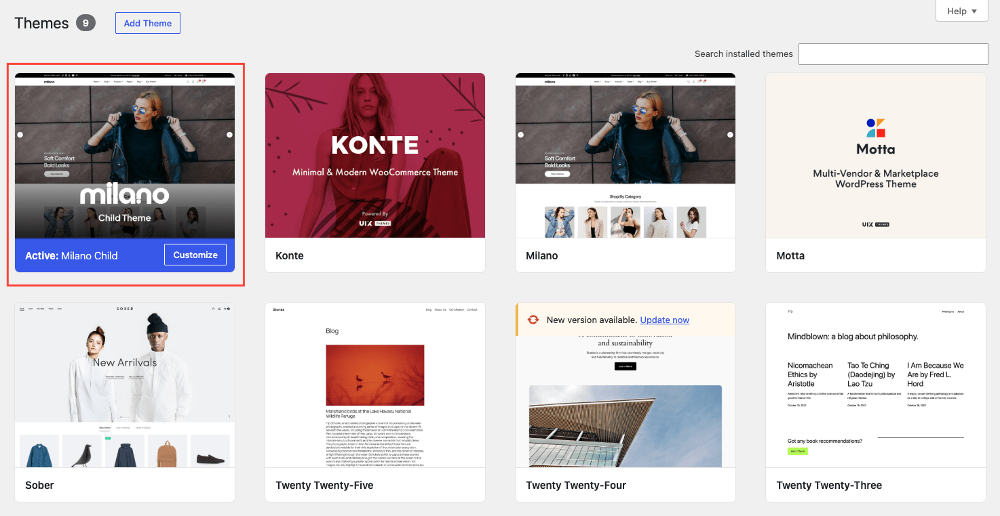

A child theme is a separate theme that inherits Milano's styles and features. You add your custom code to the child theme, so your changes survive when Milano updates.

The setup wizard installs the child theme for you as part of the first-run flow. This page covers that step in detail, plus the manual path for users who skipped the wizard or want to install it themselves.

## Why use a child theme

- **Updates stay safe.** Milano updates replace the parent theme's files. If you added custom CSS or PHP to Milano directly, your changes would be lost. The child theme is never touched by updates.
- **Cleaner debugging.** You can tell at a glance which code is yours and which is Milano's.
- **Easier to switch off.** If a customization breaks the site, deactivate the child theme and your parent theme is unchanged.

:::tip
If you only plan to change a few colors, fonts, or layout options in the Customizer, you do not need a child theme. The child theme is for custom CSS, PHP, or template overrides.
:::

## Install via the setup wizard (recommended)

The wizard handles this for you. When you reach the Child Theme step, click **Install & activate child theme** and the wizard does the rest.

If the wizard is closed, re-launch it from **Milano → Dashboard → License → Re-run the Setup Wizard**. The Child Theme step is the second of five steps.

## Install manually

Use this method if you skipped the wizard or want to install the child theme by hand.

### Method A — From your ThemeForest download

1. Go to your ThemeForest **Downloads** page.
2. Find Milano in your list and click **Download**.
3. Choose **All files and documentation** (not the installable theme only option).
4. Extract the zip. You will see a `milano-child.zip` file inside.
5. In your WordPress admin, go to **Appearance → Themes**.
6. Click **Add New**, then **Upload Theme**.
7. Choose `milano-child.zip` and click **Install Now**.
8. After install, click **Activate** on the child theme.

### Method B — From inside WordPress

If you have the full Milano package installed, you can also install the child theme through the WordPress theme installer:

1. Go to **Appearance → Themes → Add New**.
2. Click **Upload Theme**.
3. Choose `milano-child.zip` and click **Install Now**.
4. Click **Activate**.

## Verify the child theme is active

After activation, go to **Appearance → Themes**. You should see two Milano themes:

- **Milano** — the parent theme.
- **Milano Child** — the child theme, marked as **Active**.

_Themes screen with Milano Child marked as the active theme._
