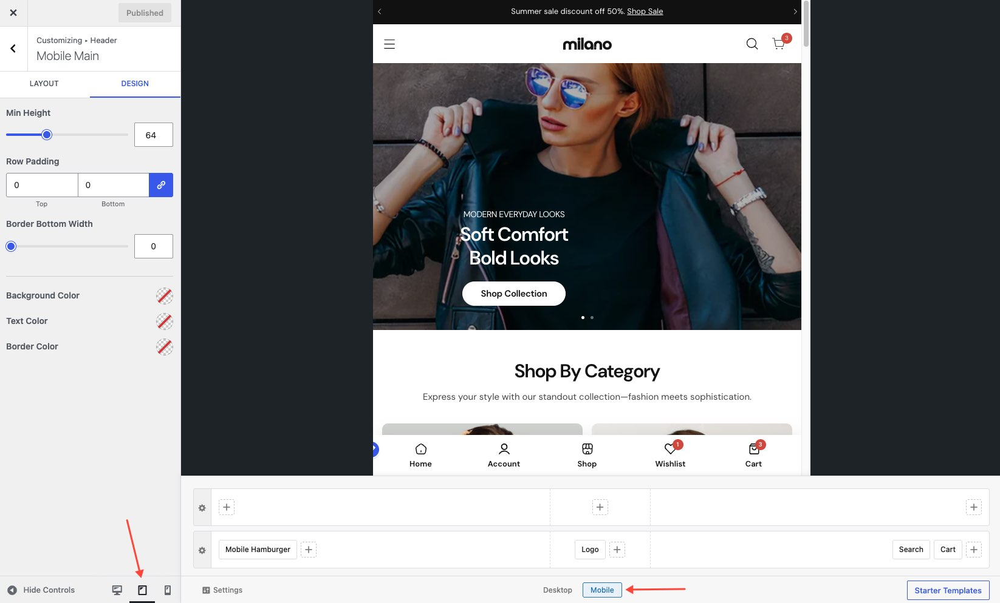
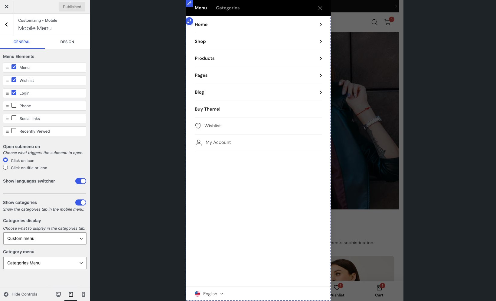

The mobile header replaces the desktop layout when visitors view your site on phones and tablets. It uses the same header builder — you just switch between **Desktop** and **Mobile** tabs at the top of the builder to design each layout.

## Design the mobile layout

Switch to the **Mobile** tab in the header builder. The mobile builder works the same way as the desktop one — add elements into rows and columns, configure row settings, and reorder by dragging.

The mobile header supports the same elements but typically with fewer columns and simpler layouts:

- **Logo** — you can set a separate logo for mobile (see [Logo settings](../logo/))
- **Menu icon** — the hamburger button that opens the mobile menu
- **Search** — search icon
- **Cart** — cart icon with item count (requires WooCommerce)
- **Account** — account icon (requires WooCommerce)

## Hamburger menu

The hamburger menu is the panel that slides in when a visitor taps the menu icon. You control what appears inside it from **Appearance → Customize → Mobile → Mobile Menu**.

### Choose and order elements

The hamburger menu can contain:

- **Menu** — the main navigation menu
- **Phone** — your phone number
- **Social** — social media links
- **Login** — login link or account icon
- **Recently viewed** — recently viewed products
- **Wishlist** — wishlist items (requires WooCommerce)
- **Language switcher** — available languages (requires WPML or Polylang)
- **Currency switcher** — available currencies (requires WooCommerce)

Add and arrange these items in the order you want them to appear in the hamburger panel.

### Categories tab

Turn on the **Categories** tab to show a second tab alongside the main menu. Visitors can switch between the menu and a category list — useful for stores with many product categories.

### Colors and header style

The Mobile Menu panel also includes settings for the hamburger menu's background color, text color, and header appearance.

## Mobile logo

The mobile header can use a separate logo image, often a cropped or smaller version. If you don't set a mobile logo, the desktop logo is used instead. You can upload a mobile logo in the **Logo** element settings. See [Logo settings](../logo/) for more.
