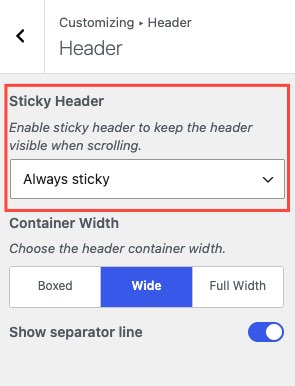

Open **Appearance → Customize → Header → Header** to configure sticky behavior.

## Behavior options

A sticky header stays at the top of the screen when visitors scroll down. You have three options:

| Behavior                | What happens                                                                                                 |
| ----------------------- | ------------------------------------------------------------------------------------------------------------ |
| **Always sticky**       | The header is fixed at the top at all times.                                                                 |
| **Sticky on scroll up** | The header hides as the visitor scrolls down and reappears when they scroll up. Often called "smart" sticky. |
| **No Sticky**           | The header scrolls with the page content.                                                                    |

