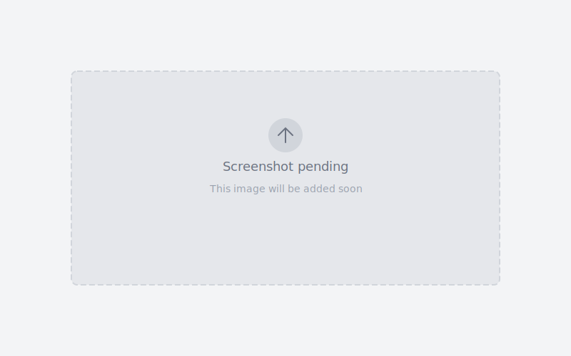

The top bar is a narrow strip above the main header row. Use it for content that stays visible across all pages.

Open **Appearance → Customize → Header → Top Bar** to configure it.

## What you can add

| Setting               | Description                                                             |
| --------------------- | ----------------------------------------------------------------------- |
| **Announcement text** | A short message displayed in the top bar.                               |
| **Social links**      | Links to your social media profiles. Icons are shown for each platform. |
| **Language switcher** | Dropdown to switch site languages. Requires WPML or Polylang.           |
| **Currency switcher** | Dropdown to switch currencies. Requires WooCommerce.                    |

## Turn the top bar on and off

The top bar has its own visibility toggle in the Customizer. When turned off, the main header starts at the very top of the page.

## Next steps

- [Header builder](../header-builder/)
- [Logo](../logo/)
