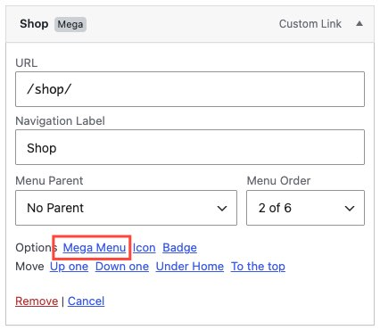
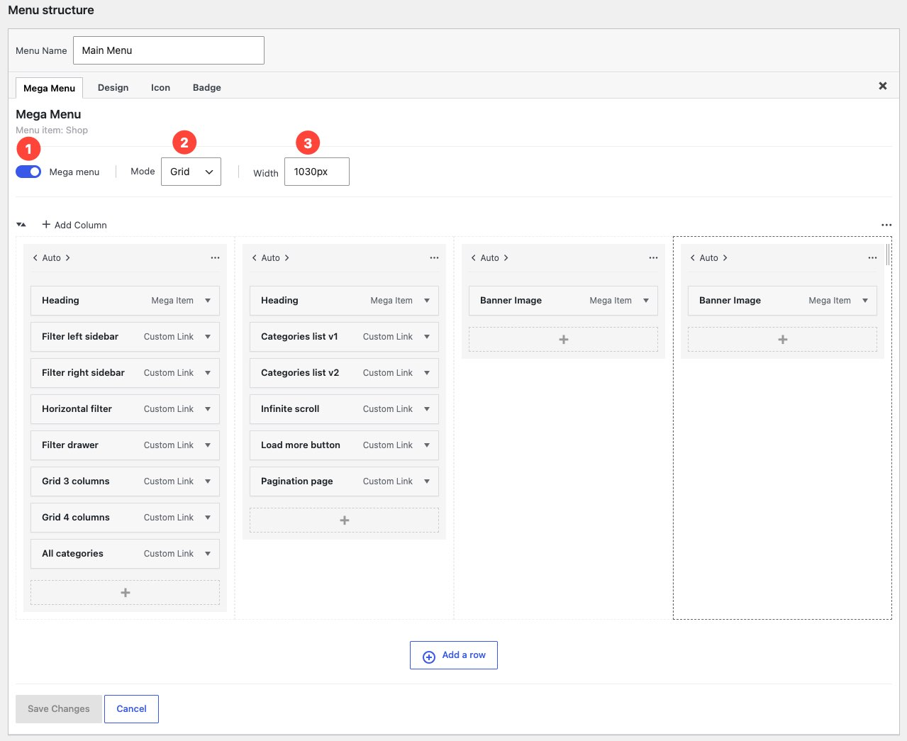

A mega menu expands into a large panel when a visitor hovers over a menu item. You can fill it with columns, images, widgets, and product categories instead of a plain list of links.

## When to use a mega menu

Use a mega menu when a single dropdown list grows too long. They work well for:

- Stores with many product categories
- Menus that need images or descriptions alongside links
- Footers that show recent posts or promotional content

:::tip
Mega menus suit desktop screens. On mobile, Milano collapses all menu items into a standard accordion list regardless of mega menu settings.
:::

## Turn on a mega menu for a menu item

1. Go to **Appearance → Menus**.
2. Select the menu that contains the item you want to convert.
3. Click the arrow on the menu item to expand its settings.
4. Check the box labeled **Mega Menu**.
5. Enable the setting **Enable mega menu**.
6. Click **Save changes**.

The item now opens a wide panel on hover instead of a narrow dropdown.

## Add rows to your mega menu

You can organize your mega menu content across multiple rows.

1. Open the mega menu item editor.
2. Click the **Add row** button to create a new row.
3. Add columns or menu items to each row as needed.
4. Click **Save menu**.

Each row can hold its own set of columns, giving you flexible control over the layout.

## Add columns to your mega menu

You control how content arranges inside the mega panel.

1. Open the mega menu item editor.
2. Click the **Add column** button to add a new column.
3. Add menu items or widgets to each column as needed.
4. Click **Save menu**.

Child items of the mega menu parent distribute across the columns you create. Add more child items to fill each column.

:::note
Columns are empty until you add items or widgets to them.
:::

## Add images to a mega menu

You can place images inside a mega menu column using the **Banner Image** widget.

1. In **Appearance → Menus**, expand the mega menu parent item.
2. Select the column where you want the image to appear.
3. Add a **Banner Image** widget item to that column.
4. Upload or choose an image from the media library.
5. Click **Save menu**.

The image appears inside the mega menu panel on the front end.

## Add widgets to a mega menu

You can add menu items and widgets directly into the mega menu columns, just like a standard menu.

1. In **Appearance → Menus**, expand the mega menu parent item.
2. You will see its columns listed as child levels.
3. Select a column and click **Add items** to add links, or add a **Widget** item to place widgets inside that column.
4. You can reorder items within each column by dragging them.
5. Click **Save menu**.

## Set the mega menu width

You can control how wide the mega panel appears.

1. Expand the mega menu item settings in **Appearance → Menus**.
2. Find the **Mega menu width** field.
3. Enter a custom width value (for example `1200px` or `90vw`).

The mega panel will use the width you set. Leave the field empty to use the default width.

1. Click **Save menu**.

## Remove a mega menu

1. Go to **Appearance → Menus**.
2. Expand the mega menu item settings.
3. Uncheck the **Use as mega menu** box.
4. Click **Save menu**.

The item returns to a standard dropdown. Any widgets you added to its widget area remain saved and reactivate if you turn the mega menu back on.

## Troubleshooting

**Problem:** The mega menu panel looks empty.
**Fix:** Add child menu items to the parent item, or place widgets in the matching widget area under **Appearance → Widgets**.

**Problem:** The mega menu does not appear on mobile.
**Fix:** This is expected. Milano shows a standard accordion menu on mobile devices. Mega menus only show on desktop screens.

**Problem:** I don't see a widget area for my mega menu item.
**Fix:** Make sure the **Use as mega menu** checkbox is checked and you have clicked **Save menu**. The widget area appears after you save.
