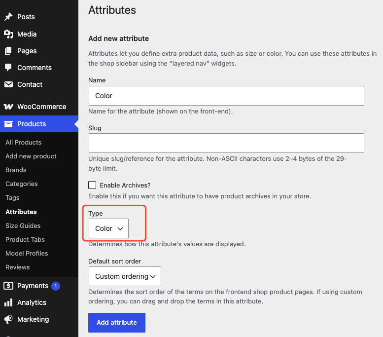
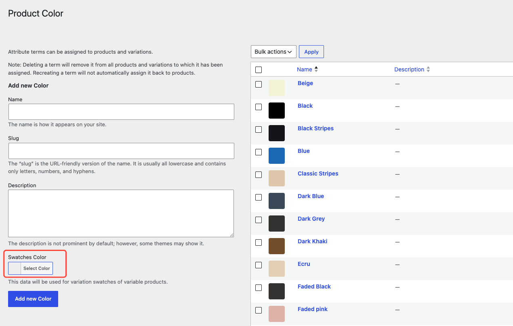

Milano gives you multiple ways to present product variations — from the default WooCommerce dropdown to visual swatches.

## Built-in variation options

WooCommerce variable products (products with options such as size or color) show each attribute as a dropdown list. Milano expands "Any" attribute values into concrete combinations so shoppers see every available option.

Pre-selection works automatically when you set default attributes in WooCommerce. The matching variation loads its image, price, and stock status without a page reload.

## Variation Compare module

The [Variation Compare module](../../theme-modules/variation-compare/) adds a modal to single product pages. It lets shoppers browse variation images by a primary attribute (for example, Color).

How it works:

- Image swatches appear in the modal.
- Selecting a swatch updates the main product image.
- Shoppers browse through variations without closing the modal.

## Show swatches with WCBoost Variation Swatches

To show color, image, or label swatches, install the free [WCBoost Variation Swatches](https://wordpress.org/plugins/wcboost-variation-swatches/) plugin. Milano integrates with it automatically. Swatches appear on product cards and single product pages with no theme setup.

### Before you begin

- Install and activate WCBoost Variation Swatches from **Plugins → Add New**.
- Work with a variable product. The steps below use global attributes, which you reuse across products.

### Step 1 — Create a global attribute with a swatch type

A global product attribute is a reusable option set you assign to any product. Color with Red, Blue, and Green terms is one example.

1. Go to **Products → Attributes**.
2. Add a **Name**, such as `Color`. Add a **Slug**, such as `color`, if you want a custom URL value. If you leave **Slug** empty, WooCommerce creates one from the name.
3. Open the **Type** list and pick how options appear:
   - **Select** — standard dropdown list.
   - **Color** — color circles.
   - **Image** — thumbnail images.
   - **Label** — text boxes, such as `S`, `M`, `L`.
   - **Button** — buttons with the term name.
4. Click **Add attribute**.

### Step 2 — Set the color, image, or label for each term

Each attribute holds terms (the individual options). You set the visual value on each term.

1. On **Products → Attributes**, find your attribute and click **Configure terms** in the **Terms** column.
2. On the left, fill in the add-term form:
   - **Name** — what shoppers see, such as `Red`.
   - **Slug** — lowercase URL value, such as `red`. Leave it empty to generate it from the name.
   - Swatch value, which changes with the attribute type:
     - **Color** type shows a **Color** picker. Pick the shade for the term.
     - **Image** type shows an **Image** field. Upload a new image or choose one from the media library.
     - **Label** type shows a **Label** field. Type the short text for the swatch, such as `XL`.
     - **Select** and **Button** types show no extra field. They use the term **Name**.
3. Click **Add new Color** (the button uses your attribute name) to save the term.
4. To update a term later, hover its name, click **Edit**, change the value, then click **Update**.

### Step 3 — Assign the attribute to your products

1. Open the product in **Products → All Products**.
2. In **Product data**, open the **Attributes** tab.
3. Add your global attribute, select its terms, turn on **Used for variations**, and click **Save attributes**.
4. Open the **Variations** tab and create variations from the attribute.

When shoppers open the product, terms appear as swatches instead of a dropdown list.

### Change the swatch type of an existing attribute

1. Go to **Products → Attributes**.
2. Hover the attribute and click **Edit**.
3. Pick a new **Type** and click **Update**.
4. Open **Configure terms** and check each term. Add the color, image, or label value the new type needs.

### Change swatch shape and size

1. Go to **Appearance → Customize → WooCommerce → Variation Swatches**.
2. Pick **Swatches Shape**: **Circle**, **Square**, or **Rounded Corners**.
3. Set **Swatches Size** in pixels. The default is 30 × 30 px.
4. Click **Publish** to save.

:::tip
To override shape or size for one product, edit the product, open **Product data → Swatches**, select the attribute, and pick **Custom**. Keep **Default** to use the Customizer values.
:::

## Extra features in WCBoost Variation Swatches Pro

The free plugin covers color, image, label, and button swatches for global attributes, plus shape, size, and tooltip controls. The [Pro version of WCBoost Variation Swatches](https://wcboost.com/plugin/woocommerce-variation-swatches/) adds:

- Dual-color and multicolor swatches for two-tone or patterned options.
- Automatic conversion of dropdown lists to image swatches from variation images.
- Main image update after a single click, without waiting for all attributes.
- Automatic selection of the remaining option when only one combination remains.
- Swatches on shop and archive pages, with live thumbnail updates and direct add to cart from the listing.
- Tooltip, size, and visible-count controls for shop-page swatches, including a +more link.
- Out-of-stock marking that keeps unavailable options visible but unselectable.

If you sell products with many combinations, these options reduce clicks and help shoppers find the right variation faster.

## Troubleshooting

**Problem:** Swatches still show as a dropdown list.
**Fix:** Check the attribute type in **Products → Attributes**. It must be **Color**, **Image**, **Label**, or **Button**, not **Select**. Then open the product, check **Used for variations** in **Product data → Attributes**, and save.

**Problem:** A color or image swatch is blank.
**Fix:** Open **Products → Attributes → Configure terms**, edit the term, and add the missing color or image value. Save and reload the product page.

## Learn more

- [WCBoost Variation Swatches plugin](https://wcboost.com/plugin/woocommerce-variation-swatches/) — feature overview, free vs Pro comparison, and pricing.
- [Configuring swatches for global product attributes](https://wcboost.com/docs/configuring-swatches-for-global-product-attributes/) — full walkthrough with screenshots.
- [Configuring the shape and size of swatches](https://wcboost.com/docs/configuring-the-shape-and-size-of-swatches/) — default vs per-product shape and size.
- [Customize swatches for individual products](https://wcboost.com/docs/configuring-variation-swatches-for-individual-products/) — per-product overrides.
- [How to show swatches on the shop page](https://wcboost.com/docs/how-to-show-swatches-on-the-shop-page/) — Pro feature for archive pages.
- [All WCBoost Variation Swatches docs](https://wcboost.com/docs-category/wcboost-variation-swatches/) — tooltips, out-of-stock handling, and auto-convert options.
