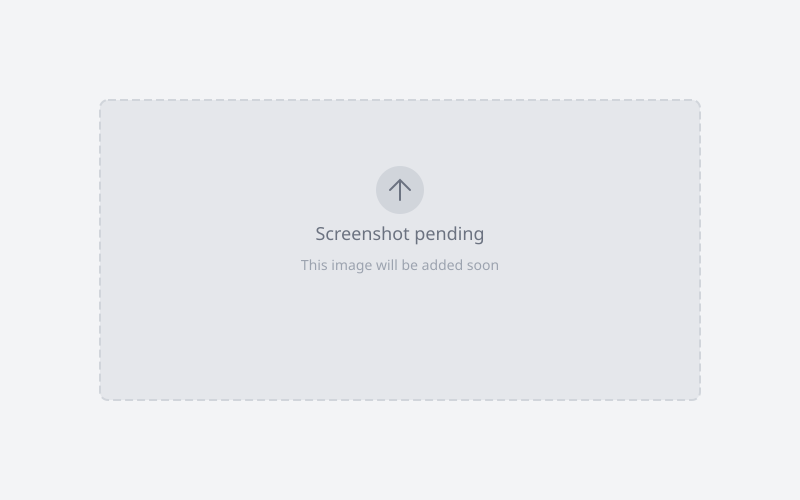

Each variation in a variable product (a product with options like color or size) can have its own image gallery. Milano shows that gallery when shoppers pick the variation.

WooCommerce 11.1 turns this feature on for all stores. There is no setting to turn on. The old Additional Variation Images extension is retired — WooCommerce turns it off automatically and moves its images into the new field.

## Before you begin

- Update WooCommerce to 11.1 or later.
- Update Milano to 1.7.0 or later.
- Work with a variable product that has at least one variation.

## Add gallery images to a variation

1. Go to **Products → All Products** and open your variable product.
2. In **Product data**, open the **Variations** tab and expand a variation.
3. Find the variation image area. Click **Manage** under **Variation gallery**.
4. Select one or more images from the media library, then confirm your selection.
5. Drag the thumbnails to reorder them. The first image becomes the main image of that variation.
6. Click **Save changes**, then click **Update** to save the product.

_Placeholder: WP admin, Products edit screen, one variation row expanded, Variation gallery field with hero + two thumbs. Replace with the real photo later._

:::tip
Add at least two images per variation you want to highlight. Shoppers see the difference right away when the gallery swaps.
:::

## Change the main image of a variation

The gallery uses the first image as the main image.

1. Open the variation again in **Product data → Variations**.
2. Drag another thumbnail to the first position.
3. Click **Save changes**, then click **Update**.

## How the gallery looks in your store

Milano replaces the product gallery with the selected variation gallery.

- When shoppers pick a variation with several images, the whole gallery switches to that variation gallery.
- When shoppers pick a variation with one image, Milano keeps the parent gallery and updates the first image. This matches the previous WooCommerce behavior.
- When a variation has no images, Milano keeps showing the parent product gallery.
- Zoom, lightbox, and thumbnail settings from **Appearance → Customize → Product Page → Gallery** apply to variation galleries.

_Placeholder: frontend product page, color variation selected, gallery showing variation images only. Replace with the real photo later._

:::note
If you used the Additional Variation Images extension before, WooCommerce copies those images in the background after you update. Large catalogs need time to finish. Check progress under **WooCommerce → Status → Scheduled Actions** in the `woocommerce-db-updates` group.
:::

## Troubleshooting

**Problem:** The gallery does not switch when a variation is picked.
**Fix:** Check that the variation has more than one image saved, then clear your site and browser cache and test again.

**Problem:** Old extension images are missing after the update.
**Fix:** Allow the background migration to finish before re-saving variations. Go to **WooCommerce → Status → Scheduled Actions** and look for pending `woocommerce-db-updates` actions. Do not write to the old `meta:_wc_additional_variation_images` field — WooCommerce 11.1 no longer reads new values from it.

**Problem:** The gallery works in one theme but not in Milano.
**Fix:** Update Milano to the latest version, then test with all cache and image optimization plugins paused. If the issue stays, contact support with the product URL and the variation that fails.

## Learn more

- [WooCommerce 11.1 release notes — variation image galleries](https://developer.woocommerce.com/2026/09/03/wc-11-1-release-notes/)
- [Additional Variation Images included in WooCommerce 11.1](https://developer.woocommerce.com/2026/09/01/additional-variation-images/)
- [Bringing variation galleries into core](https://developer.woocommerce.com/2026/05/19/bringing-variation-galleries-into-core/)
- [WooCommerce Additional Variation Images documentation](https://woocommerce.com/document/woocommerce-additional-variation-images/)
