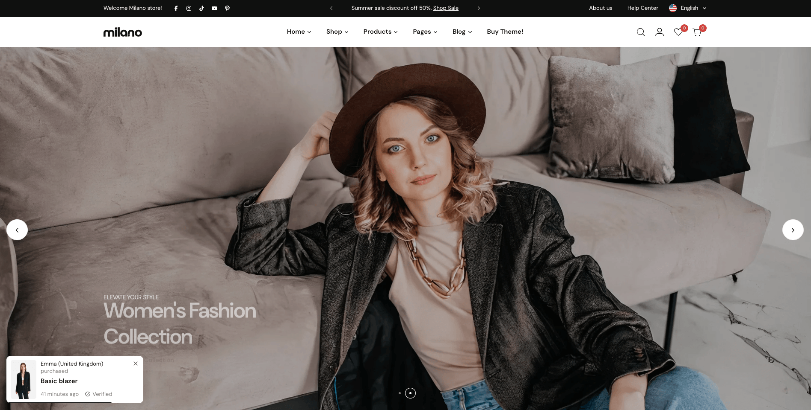
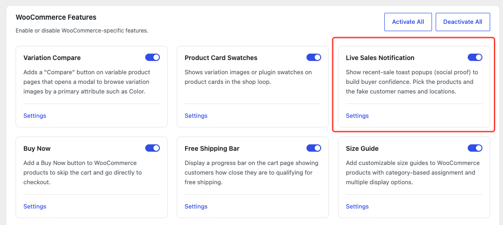
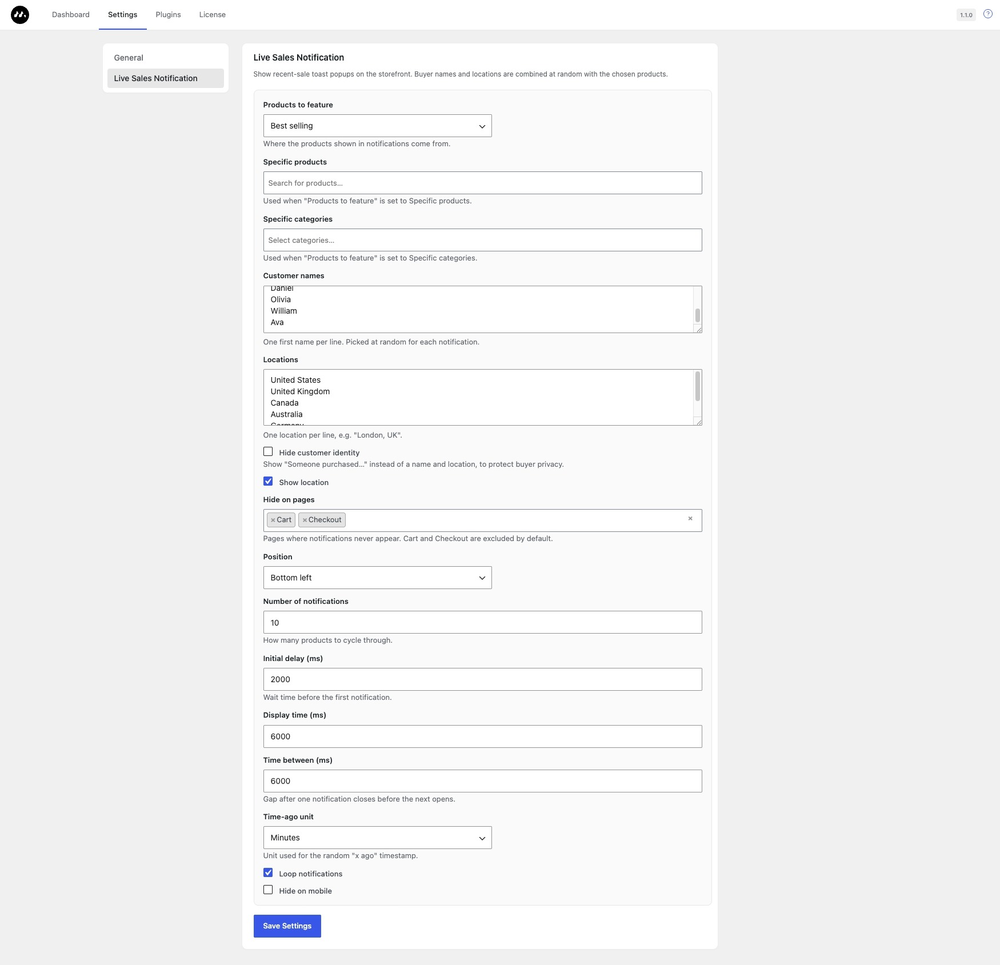

The Live Sales Notification module shows toast popups that look like recent purchases. It picks random products, customer names, and locations you define — all on the client side, so it's safe with full-page caching.

## Turn on Live Sales Notification

1. Go to **Milano Dashboard → Modules**.
2. Find **Live Sales Notification** and turn the toggle on.

## Choose which products to feature

1. Go to **Milano Dashboard → Settings** and scroll to the **Live Sales Notification** section.
2. Set **Products to feature** to one of the following:
   - **Best selling** — Products with the most sales (default).
   - **Featured** — Products marked as featured.
   - **On sale** — Products currently on sale.
   - **Newest** — Most recently published products.
   - **Top rated** — Highest customer-rated products.
   - **Specific products** — Choose individual products using the search field.
   - **Specific categories** — Choose entire categories.

3. Click **Save Changes**.

## Customize buyer names and locations

The module composes messages like "Michael (United States) purchased…" by combining a random name and location from your lists.

- **Customer names** — One first name per line. These are picked at random. Defaults to Michael, Sophia, James, Emma, Daniel, Olivia, William, Ava.
- **Locations** — One location per line, for example "London, UK". Defaults to United States, United Kingdom, Canada, Australia, Germany, France.
- **Show location** — Turn off to hide the location from the notification.
- **Hide customer identity** — Turn on to show "Someone purchased…" instead of a real name and location.

## Control timing and appearance

- **Position** — Where the toast appears: bottom left (default), bottom right, top left, or top right.
- **Number of notifications** — How many products to cycle through (default: 10).
- **Initial delay (ms)** — Wait time before the first notification appears (default: 6000).
- **Display time (ms)** — How long each toast stays visible (default: 6000).
- **Time between (ms)** — Gap after one toast closes before the next one opens (default: 6000).
- **Time-ago unit** — The unit for the random "x ago" timestamp (minutes, hours, or seconds).
- **Loop notifications** — Turn off to stop showing notifications after the product list runs through once.
- **Hide on mobile** — Turn on to suppress notifications on screens narrower than 768 px.

## Exclude pages

Use **Hide on pages** to prevent notifications from showing on specific pages. Cart and Checkout are excluded by default.

## Requirements

- WooCommerce must be installed and active.
