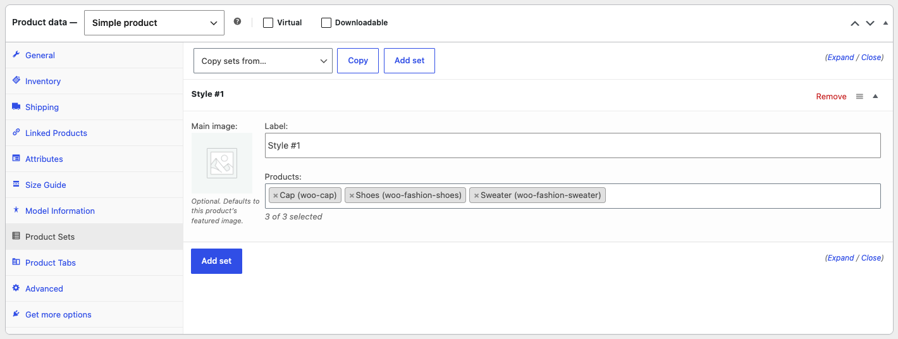
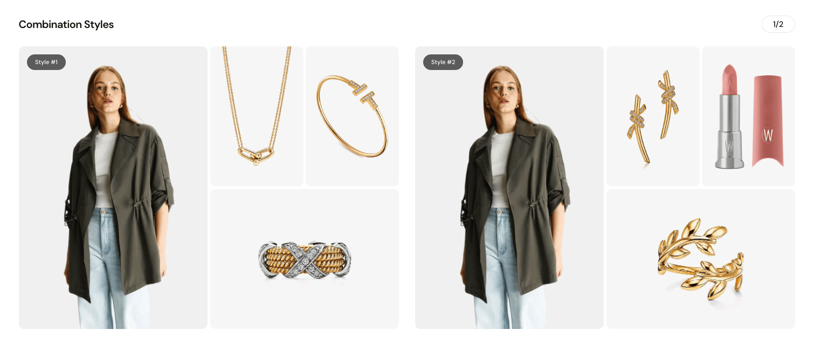

Product Sets lets you curate mix-and-match combinations on each product page. Each set pairs the product being viewed with up to three complementary items. The sets appear as a carousel below the product summary so shoppers can see outfit or bundle ideas at a glance.

## Turn on Product Sets

1. Go to **Milano Dashboard → Modules**.
2. Find **Product Sets** and turn the toggle on.

## Add sets to a product

1. Edit a product.
2. Scroll to the **Product Data** meta box and open the **Product Sets** tab.

   

   _Placeholder: Product Data box with the **Product Sets** tab selected, showing one or two set rows (Label, Main image, Products). Replace with the actual screenshot._

3. Click **Add set**. A new set row appears. Each set has:
   - **Label** — The name shown as a badge over the main image (for example, "Casual look"). Leave it blank and Milano shows "Style #1", "Style #2", and so on.
   - **Main image** — Optional. Click the thumbnail to open the media library and pick an image for the large tile. If you leave it blank, Milano shows the product's featured image with the theme's card thumbnail ratio, hover, and placeholder handling.
   - **Products** — Search for and select up to three products that go well with the current one. Type to search — you can pick products and individual variations. The current product is excluded from results.

4. Repeat for each combination you want to show. Drag the handle on a row to reorder sets. Use **Expand** / **Close** to open or collapse all rows.
5. To remove a set, click **Remove** in its header.
6. Click **Update** to save the product.

### Copy sets from another product

To reuse combinations you already curated elsewhere:

1. At the top of the **Product Sets** tab, search for a product in **Copy sets from…**.
2. Click **Copy**.

Milano appends that product's sets to the list. You can then edit labels, images, and products before saving. Sets with no products are skipped. The counter at the top shows how many sets were copied.

:::note
A set is saved only when it has at least one product. Empty sets are dropped on save.
:::

### How sets appear on the product page

- Milano renders the sets as a horizontal carousel.
- Each slide is one set. The large tile on the left is the product being viewed; the tiles on the right are the complementary items. The layout adapts to how many items a set contains: one item fills the right column, two items stack vertically, three items use a two-by-two grid with the third item spanning the bottom row.
- Secondary tiles show the product image and an add-to-cart button. The product name and price stay hidden so the grid stays compact.
- On the frontend, Milano hides any set whose complementary products are no longer visible (for example, draft or hidden catalog items). If a product has no renderable sets, the whole section is hidden.

_Placeholder: Frontend product page with the Product Sets section below the summary, heading "Combination Styles", counter "1 / 2", first slide badge "Casual look" and two complementary tiles with add-to-cart buttons. Replace with the actual screenshot._

## Configure the carousel

1. Go to **Appearance → Customize → Product Page → Product Sets**.
2. Change:
   - **Heading** — Title above the carousel. Default: `Combination Styles`. Leave blank to hide the heading. The slide counter still shows if turned on.
   - **Position** — Where the section appears on the single product page.

     | Value                   | Placement                                    |
     | ----------------------- | -------------------------------------------- |
     | Before product tabs     | Above the Description/Reviews tabs (default) |
     | After product tabs      | Below the tabs, before upsells               |
     | Before upsells          | Before the "You may also like" upsells       |
     | Before related products | Before the related products grid             |

   - **Sets per view** — How many sets are visible at once. Responsive: set a value for desktop, tablet, and mobile. Minimum 1, maximum 4. Defaults: 2 on desktop, 1 on tablet and mobile.
   - **Maximum sets** — The most sets to render, no matter how many the product has saved. Minimum 1, maximum 12. Default: 6.
   - **Show set label** — Turn on to show the set's label as a badge over the main image. Turn off to hide all badges. Default: on.
   - **Show slide counter** — Turn on to show the current slide number as a fraction (for example, `2 / 4`). The counter appears only when the product has more than one set. Default: on.

3. Click **Publish**.

## Requirements

- WooCommerce must be installed and active.
- The product must have at least one set with at least one visible complementary product.

## Troubleshooting

**Problem:** The section does not appear on the product page.
**Fix:** Check that the module is turned on under **Milano Dashboard → Modules** and that the product has at least one set with a visible product in the **Product Sets** tab. Draft, private, or hidden-catalog products are not rendered and the section stays hidden if nothing remains.

**Problem:** A copied set did not come through.
**Fix:** The source product may have no sets, or all its sets were empty. Also check that the source product is a product — pages and other post types return no sets.

**Problem:** You cannot add more than three products to a set.
**Fix:** This is intentional. A set holds at most three complementary items plus the main product. Create a second set if you want to show another combination.

## Next steps

- [Complementary Products](./complementary-products/) — Show a single list of "pairs well with" items instead of curated sets.
- [Product Tabs](./product-tabs/) — Reorder tabs or add custom tabs that can sit alongside the sets section.
